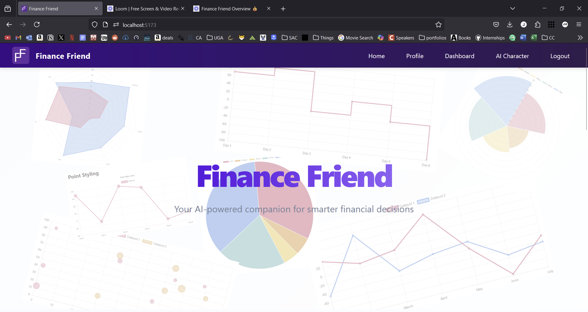
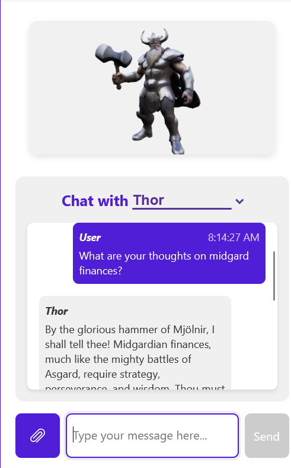
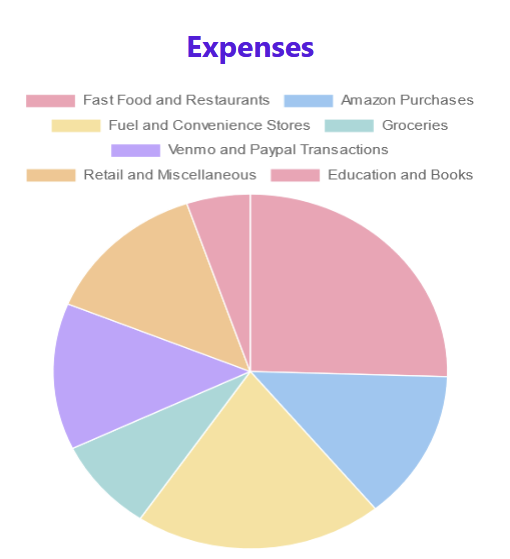
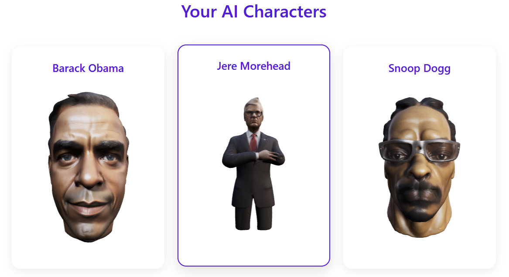

# Finance Friend

> An AI-powered financial advisor that combines personalized guidance with interactive 3D visualization.

[](https://youtu.be/uC2L6qnkAE4)

## Features

### AI Financial Advisor
- Create your personalized AI advisor with unique personality
- Get real-time financial guidance through natural conversations
- Interact with a customizable 3D character

### Smart Dashboard
- Interactive financial analytics with Chart.js
- Data visualization

## Tech Stack

### Frontend


### Backend


### AI/ML
- OpenAI API for natural language processing
- Custom financial advice models
- Meshy for 3D character generation

## Screenshots

<table>
  <tr>
    <td></td>
    <td></td>
  </tr>
  <tr>
    <td></td>
    <td></td>
  </tr>
  <tr>
    <td></td>
  </tr>
</table>

## Quick Start

### Prerequisites
- Node.js (v14+)
- MongoDB
- npm or Yarn

### Installation

```bash
# Clone the repository
git clone https://github.com/JohnMedlock/Financial-Helper.git
cd Financial-Helper

# Install dependencies
npm install

# Start development servers
npm run dev
```

### Environment Variables

```env
PORT=3000
MONGO_URI=your_mongodb_connection_string
JWT_SECRET=your_jwt_secret
OPENAI_API_KEY=your_openai_api_key
```

## Team

| Name | Role | GitHub |
|------|------|--------|
| Grant Moore | Frontend | [@jgrantmoore](https://github.com/grantmoore) |
| John Medlock | Frontend | [@JohnMedlock](https://github.com/JohnMedlock) |
| Dylan Carter | Backend | [@dylanwcarter](https://github.com/dylancarter) |
| Rishab Seshadri | Backend | [@RishabSeshadri](https://github.com/rishabseshadri) |

## 📝 License

This project is licensed under the MIT License - see the [LICENSE](./LICENSE) file for details.

## Acknowledgments

- [React](https://reactjs.org/) Community
- [Three.js](https://threejs.org/) Community
- [MongoDB](https://www.mongodb.com/) Team
- [OpenAI](https://openai.com/) Team