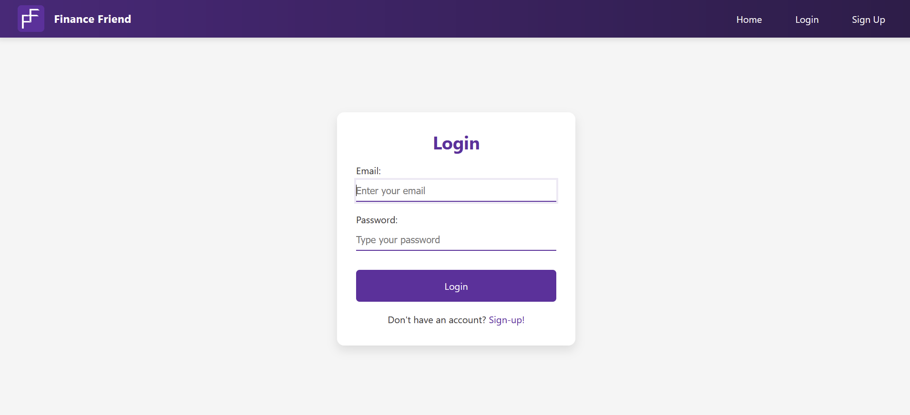

# Financial Helper

A modern web application that provides AI-powered financial advice and portfolio management with interactive 3D visualization.

---

## Overview

Financial Helper is a full-stack application that combines artificial intelligence, real-time analytics, and interactive 3D dashboards to help users make smarter financial decisions.

---

## Features

-   **AI Financial Advisor**
    -   Customize your personal AI advisor
    -   Receive tailored financial guidance through natural conversations
    -   Engage with a 3D character for real-time interactions

-   **Smart Dashboard**
    -   Interactive charts and data visualization
    -   Real-time financial analytics
    -   Portfolio performance tracking

-   **Goal Management**
    -   Set and track financial goals
    -   Intelligent progress monitoring
    -   Personalized achievement strategies

-   **Secure Platform**
    -   JWT authentication
    -   Protected API routes
    -   Encrypted data transmission

---

## Tech Stack

**Frontend**

*   [React](https://reactjs.org/) for UI development
*   [Three.js](https://threejs.org/) for 3D rendering
*   [Framer Motion](https://www.framer.com/motion/) for animations
*   [Axios](https://axios-http.com/) for API communication
*   [Chart.js](https://www.chartjs.org/) for financial graph rendering

**Backend**

*   [Node.js](https://nodejs.org/) for the runtime environment
*   [Express.js](https://expressjs.com/) for the web framework
*   [MongoDB](https://www.mongodb.com/) for the database
*   [JSON Web Tokens (JWT)](https://jwt.io/) for authentication
*   [Meshy](https://meshy.ai/) for 3D model generation
*   [OpenAI API](https://openai.com/api/) for natural language processing and AI interactions
*   [Google Cloud Vision API](https://cloud.google.com/vision) for image analysis
*   [Google Cloud Storage](https://cloud.google.com/storage) for file storage

**AI/ML**

*   Custom AI models for financial advice
*   Natural Language Processing
*   3D character generation

---

## Getting Started

### Prerequisites

*   [Node.js](https://nodejs.org/) (v14 or higher)
*   [MongoDB](https://www.mongodb.com/)
*   npm (included with Node.js) or [Yarn](https://classic.yarnpkg.com/)

### Installation

1.  Clone the repository:

    ```bash
    git clone https://github.com/JohnMedlock/Financial-Helper.git
    cd Financial-Helper
    ```
2.  Install backend dependencies:

    ```bash
    cd backend
    npm install
    ```
3.  Install frontend dependencies:

    ```bash
    cd ../frontend
    npm install
    ```
4.  Create a `.env` file in the backend directory with the following variables:

    ```
    PORT=3000
    MONGO_URI=your_mongodb_connection_string
    JWT_SECRET=your_jwt_secret
    ```
5.  Start the development servers:

    **Backend**

    ```bash
    cd backend
    npm run dev
    ```

    **Frontend**

    ```bash
    cd frontend
    npm run dev
    ```

After both servers start, you can access:

*   Frontend: [http://localhost:5173](http://localhost:5173)
*   Backend: [http://localhost:3000](http://localhost:3000)

---

## Team

*   Grant Moore
*   Dylan Carter
*   John Medlock
*   Rishab Seshadri

---

## Problems Faced

*   **CORS Issues:** We encountered Cross-Origin Resource Sharing (CORS) issues when integrating with third-party APIs, particularly when fetching 3D models from Meshy. To resolve this, we implemented a proxy middleware in our backend to handle the requests and set the appropriate CORS headers.
*   **Asynchronous Data Handling:** Managing asynchronous data flow between the frontend and backend, especially when dealing with external APIs, required careful handling of promises and async/await. We used useEffect hooks and state management techniques to ensure data consistency and prevent race conditions.
*   **3D Model Optimization:** Optimizing 3D models for web rendering was a challenge. We addressed this by using efficient model formats (like GLB), compressing textures, and implementing level-of-detail (LOD) techniques to improve performance on different devices.
*   **AI Integration:** Integrating the OpenAI API for natural language processing and AI interactions required careful prompt engineering and error handling. We implemented rate limiting and fallback mechanisms to ensure a smooth user experience even when the API was under heavy load.
*   **Authentication and Authorization:** Implementing secure authentication and authorization using JWTs required careful attention to detail. We followed best practices for storing and handling tokens, and we implemented role-based access control to protect sensitive API endpoints.
*   **Responsive Design:** Ensuring a responsive design that works well on different screen sizes and devices was a challenge. We used CSS media queries and flexible layouts to create a consistent user experience across all platforms.
*   **Graph Rendering with Chart.js:** We faced challenges rendering financial graphs using Chart.js, particularly with performance and responsiveness on different devices. We addressed this by optimizing data structures, implementing lazy loading, and fine-tuning chart configurations for better performance.

---

## License

This project is licensed under the MIT License – see the [LICENSE](./LICENSE) file for details.

---

## Acknowledgments

*   [React](https://reactjs.org/) Community
*   [Three.js](https://threejs.org/) Community for 3D rendering
*   [MongoDB](https://www.mongodb.com/) team for database solutions
*   [Node.js](https://nodejs.org/) & [Express](https://expressjs.com/) for the backend
*   Contributors and maintainers

---

## Media

### Demo Video

[](https://youtu.be/uC2L6qnkAE4)

### Screenshots





